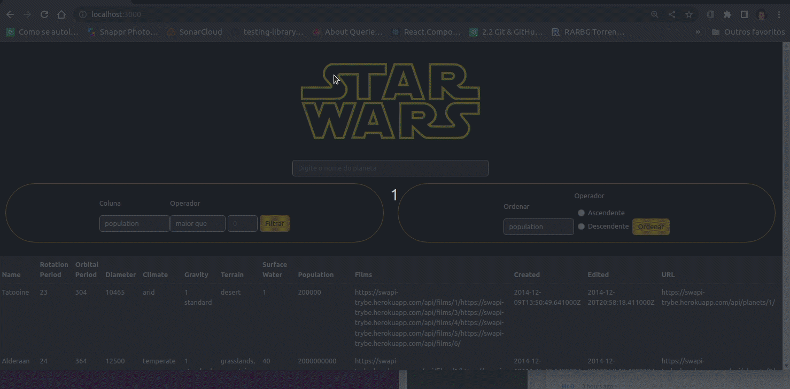

# Star Wars Planet Search

Projeto Front-End, em que o desafio foi fazer um site de pesquisas, baseado no universo fictício de Star Wars, onde é possível:
1- Filtrar planetas por nome.

2 - Filtrar, com base em uma categoria pré-selecionada, se essa mesma categoria é maior, menor, ou igual, a um determinado número inserido. Por exemplo: planetas que possuem uma população[categoria] maior que 3000[numeroInseridoPeloUsuário]

3- O Usuário também pode multiplicar os filtros, limitado apenas por um filtro por categoria. Por exemplo, é possível filtrar planetas que possuem uma população[categoria] maior que 3000[numeroInseridoPeloUsuário] e que também possuem um diâmentro[categoria] menor que 10.000[numeroInseridoPeloUsuário]

4 - Também é possível ordenar a tabela em ordem crescente ou descrescente baseando-se em uma categoria. Por exemplo, o usuário pode ordenar a tabela em ordem decrescente tomando como base o número populacional ou o tempo de rotação do planeta.

## Ferramentas Utilizadas
<ul>
<li>React</li>
<li>Context Api</li>
<li>React Hooks</li>
<li>Bootstrap</li>
</ul>

## Project Preview


## :pushpin: Instalando o projeto
Clone o projeto e entre no diretório
```bash
  git clone git@github.com:AlectorAlexander/project-starwars-planets-search.git && cd project-starwars-planets-search
```
Instale as dependências
```bash
  npm install
```
Inicie a aplicação
```bash
  npm run start
```
